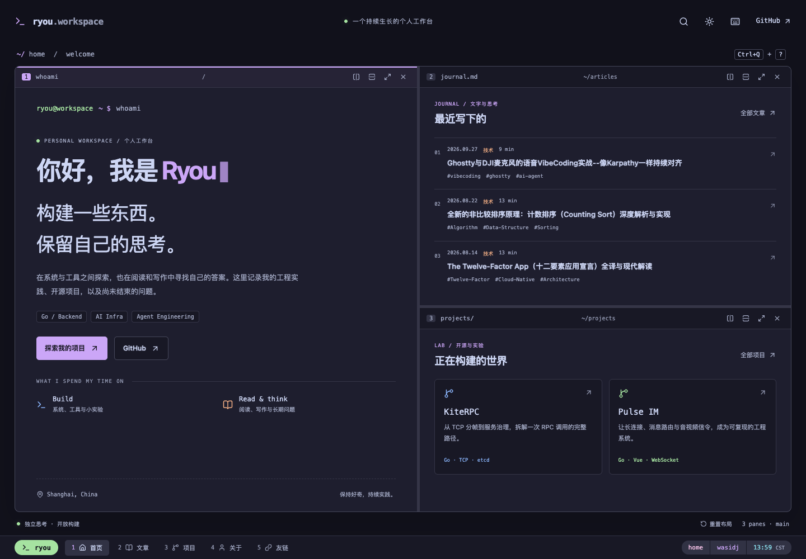

# Ryou workspace

基于 Next.js App Router、React 和 TypeScript 的个人工作台。视觉与交互来自 [我的 tmux 配置](https://github.com/WASIDJ/.config/blob/main/tmux/tmux.conf)，保留 Obsidian Markdown → blog-content → GitHub Pages 的写作与发布流程。



## 开发与预览

需要 Node.js 22+、Git，以及已初始化的子模块。

```bash
git clone --recurse-submodules https://github.com/WASIDJ/hugo-main.git
cd hugo-main
npm ci
npm run dev
```

访问 http://localhost:3000。内容编译读取 `content` 子模块 **HEAD 中已提交的文件**，不会发布本地未提交修改、草稿或隐藏工具目录。写作后先在 blog-content 提交内容，再构建站点；本地可用 `git -C content fetch origin main` 和 `git -C content checkout --detach origin/main` 选择最新已发布内容。

```bash
npm run check       # 内容 / pane 单元测试、生产构建、旧链接审计、类型检查
npx playwright install chromium
npm run test:e2e    # 浏览器交互、响应式、无 JS、统计协议与可访问性
npm run preview     # 在 3000 端口预览 out/，未知路径返回真正的 404
```

macOS 浏览器测试使用已安装的 Google Chrome，Linux CI 使用 Playwright Chromium。预览服务器只绑定本机；可通过 `PORT=3001 npm run preview` 更改端口。预览不写入生产阅读统计，统计上报测试完全拦截请求。

## 工作台操作

桌面默认三个 pane：介绍、文章和项目。拖动分隔线调整尺寸，最多同时打开四个 pane。手机显示当前聚焦 pane；所有操作也可以从顶部键盘按钮进入。布局按页面在本地保存，关闭最后一个 pane 或点击“重置布局”恢复默认。

| 按键                   | 操作                          |
| ---------------------- | ----------------------------- |
| `Ctrl+q` 后 `1–5`      | 首页、文章、项目、关于、友链  |
| 前缀后 `v / s`         | 左右 / 上下分屏并选择内容     |
| 前缀后 `z / x`         | 放大还原 / 关闭 pane          |
| 前缀后 `o / u / b / ?` | 链接 / 栏目 / 上一栏目 / 设置 |
| `Alt+h/j/k/l`          | 方向切换焦点                  |
| `Alt+Shift+h/j/k/l`    | 调整分屏比例                  |
| `Alt+n/p`              | 下一个 / 上一个栏目           |

前缀有效期两秒，`Esc` 取消。系统或浏览器可能占用组合键，可在设置中重新绑定前缀或关闭快捷键。输入框内不接管快捷键。分隔线可聚焦后用方向键调整。

## 内容与检索

- 支持现有 YAML frontmatter、中文文件名、`slug`、`url`、`aliases`、分类和标签。
- Markdown 通过 remark / rehype 编译，支持 GFM、数学公式、代码高亮、Mermaid、callout、脚注和宽屏边注。原始 HTML 经过清理；未知 Hugo shortcode 会报告，CI 阻止带此类问题的内容上线。
- 首标题与 frontmatter 标题相同时只展示一次，保留正文标题的片段锚点。
- 页面生成完整 HTML，关闭 JavaScript 后正文与栏目导航仍可阅读。全文搜索、分屏、图表增强和评论需要 JavaScript。
- 全文搜索索引按需加载；RSS 为 `/index.xml`，保留旧栏目 feed。不存在的链接返回 404。
- 旧文章主路径和别名保留；别名页面使用主页面 canonical 并设为 noindex，GitHub Pages 上不声称提供 HTTP 301。
- Giscus 使用原主路径的编码形式作为讨论标识；Cloudflare 统计 API 和 D1 数据结构保持兼容。
- 项目案例维护于 `src/lib/projects.json`，事实依据与版本见 [迁移与验收记录](docs/migration.md)。

## 发布

内容仓库继续发送 `blog-content-updated` dispatch。生产构建先选择最新 blog-content main 提交，校验 dispatch SHA 属于 main 历史，将选定 SHA 固定并记录到 `/build-info.json`。构建不回写代码仓库，也不更新主题子模块。

PR 运行完整检查并提供可下载的静态预览 artifact；main 通过检查后，将 `out/` 发布到 WASIDJ/wasidj.github.io 的 main，使用现有 `GH_PAGE_ACTION_TOKEN`。域名、CNAME、Google / Bing 验证文件和统计 Worker 路由沿用现状。

SEO 包括独立标题描述、canonical、分享卡片、sitemap、robots 与内容一致的结构化数据。GEO 以清晰作者身份、项目证据和可引用内容为基础；没有隐藏的模型权重提示。

上线检查和 Hugo 回滚依据见 [迁移与验收记录](docs/migration.md)。
