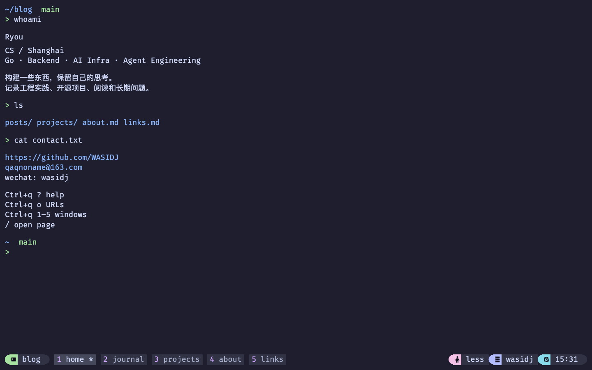

# Ryou workspace

基于 Next.js App Router、React 和 TypeScript 的个人工作台。视觉与交互来自 [我的 tmux 配置](https://github.com/WASIDJ/.config/blob/main/tmux/tmux.conf)，保留 Obsidian Markdown → blog-content → GitHub Pages 的写作与发布流程。



当前分支按 `.config` 的 Ghostty/tmux 设置实现全键盘版本，仍待用户参考 PNG 与不需要部分的 TIFF 做视觉对照；不是已经完成截图复刻的最终版本。

## 开发与预览

需要 Node.js 22+、Git，以及已初始化的子模块。

```bash
git clone --recurse-submodules https://github.com/WASIDJ/hugo-main.git
cd hugo-main
npm ci
npm run dev
```

访问 http://localhost:3000。内容编译读取 `content` 子模块 **HEAD 中已提交的文件**，不会发布本地未提交修改、草稿或隐藏工具目录。写作后先在 blog-content 提交内容，再构建站点；本地可用 `git -C content fetch origin main` 和 `git -C content checkout --detach origin/main` 选择最新已发布内容。

```bash
npm run check       # 内容 / pane 单元测试、生产构建、旧链接审计、类型检查
npx playwright install chromium
npm run test:e2e    # 浏览器交互、响应式、无 JS、统计协议与可访问性
npm run preview     # 在 3000 端口预览 out/，未知路径返回真正的 404
```

macOS 浏览器测试使用已安装的 Google Chrome，Linux CI 使用 Playwright Chromium。预览服务器只绑定本机；可通过 `PORT=3001 npm run preview` 更改端口。预览不写入生产阅读统计，统计接口沿用既有路径。

## 工作台操作

默认关闭鼠标，通过 `Ctrl+q m` 开启或关闭 pane 鼠标操作。窗口和 session 分开管理；状态栏只显示文字与 Nerd Font glyph，没有网页工具栏或 pane 按钮。字体使用本地托管的 FiraCode Nerd Font Mono 子集，字号 18px，窗口内边距 12px。

| 按键                                  | 操作                                               |
| ------------------------------------- | -------------------------------------------------- |
| 前缀 `Ctrl+q` 后 `1–9`                | 选择当前 session 的 window                         |
| 前缀后 `Ctrl+c / Ctrl+r`              | 新建 / 重命名 session                              |
| 前缀后 `u / g / b / ) / (`            | session 列表 / 名称切换 / 上一个 / 下一个 / 前一个 |
| 前缀后 `Q`                            | 关闭 session                                       |
| 前缀后 `c / r / , / X`                | 新建 / 重命名 / 重命名 / 确认关闭 window           |
| `Alt+n / Alt+p`                       | 下一个 / 上一个 window                             |
| 前缀后 `v / s`                        | 左右 / 上下分屏，新的 pane 显示本地博客命令提示符  |
| `Alt+h/j/k/l`                         | 方向切换 pane                                      |
| `Alt+Shift+h/j/k/l`                   | 调整 pane 尺寸                                     |
| 前缀后 `z / x / m`                    | 放大还原 / 关闭 pane / 切换鼠标                    |
| 前缀后 `Enter`，随后 `v`、方向键、`y` | vi 复制模式、选择、复制                            |
| 前缀后 `o / w / ?`                    | URL 列表 / window 列表 / 帮助                      |
| `Alt+v / Alt+s / Alt+z / Alt+=`       | Ghostty 对应的分屏 / 放大 / 等分                   |
| `/`                                   | 打开页面选择器；选择器里用 `/` 进入筛选输入        |

前缀持续等待操作键，`Esc` 取消；单独按下 Ctrl、Alt、Shift 不消耗前缀。当前浏览器版命令只浏览博客：`whoami`、`posts`、`projects`、`about`、`links`、`open <path|number>`、`cat <slug>`、`search <words>`、`theme dark|light`、`font <size>`、`comments`、`clear`。`bind a` 可将前缀改为 Ctrl+A；这不执行系统 shell。

持久化保存 session、window、pane 布局和用户命名。新版本使用独立的 v2 状态，避免继续恢复旧版的三卡片布局。鼠标模式每次加载默认关闭。

原配置中的私人 Codex 周额度脚本不在公共网页运行；`Ctrl+q Ctrl+u` 显示当前网页 session/pane 状态。真实 Mac mini 终端区域是用户之后实现的独立功能，设计分析见 [Mac mini 终端方案](docs/mac-mini-terminal-plan.md)。

## 内容与检索

- 支持现有 YAML frontmatter、中文文件名、`slug`、`url`、`aliases`、分类和标签。
- Markdown 通过 remark / rehype 编译，支持 GFM、数学公式、代码高亮、Mermaid、callout、脚注。原始 HTML 经过清理；未知 Hugo shortcode 会报告，CI 阻止带此类问题的内容上线。
- 首标题与 frontmatter 标题相同时只展示一次，保留正文标题的片段锚点。
- 页面生成完整 HTML，关闭 JavaScript 后正文与栏目导航仍可阅读。全文搜索、分屏、图表增强和评论需要 JavaScript。
- 全文搜索索引按需加载；RSS 为 `/index.xml`，保留旧栏目 feed。不存在的链接返回 404。
- 旧文章主路径和别名保留；别名页面使用主页面 canonical 并设为 noindex，GitHub Pages 上不声称提供 HTTP 301。
- Giscus 使用原主路径的编码形式作为讨论标识；Cloudflare 统计 API 和 D1 数据结构保持兼容。
- 项目案例维护于 `src/lib/projects.json`，事实依据与版本见 [迁移与验收记录](docs/migration.md)。

## 发布

内容仓库继续发送 `blog-content-updated` dispatch。生产构建先选择最新 blog-content main 提交，校验 dispatch SHA 属于 main 历史，将选定 SHA 固定并记录到 `/build-info.json`。构建不回写代码仓库，也不更新主题子模块。

PR 运行完整检查并提供可下载的静态预览 artifact；main 通过检查后，将 `out/` 发布到 WASIDJ/wasidj.github.io 的 main，使用现有 `GH_PAGE_ACTION_TOKEN`。域名、CNAME、Google / Bing 验证文件和统计 Worker 路由沿用现状。

SEO 包括独立标题描述、canonical、分享卡片、sitemap、robots 与内容一致的结构化数据。GEO 以清晰作者身份、项目证据和可引用内容为基础；没有隐藏的模型权重提示。

上线检查和 Hugo 回滚依据见 [迁移与验收记录](docs/migration.md)。
