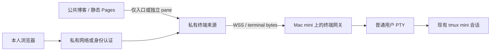

# 后续想法：网页里的 Mac mini 真实终端区域

状态：设计分析，留给用户之后实现。本次终端外观改版不接入家中机器，不创建 Tunnel、Access 应用或远端服务。

## 原始意图与已确认上下文

家中的 Mac mini 将长期在线。网页中预留一块私有区域，打开后像在本机执行 `ssh mini-t` 一样，直接查看和操作现有环境，继续使用自己的 tmux 配置与快捷键。

现有 `mini-t` 别名启用 TTY，并在远端设置 UTF-8 locale 后运行 `tmux -u new -A -s mini`。因此验收目标是接回原有 `mini` 会话，而不是在网页里另起一个没有上下文的演示终端。这里不公开私有网络地址、账户标识或凭据。

当前博客是 Next.js 静态导出，发布到 GitHub Pages。真实终端的 PTY、连接认证和 WebSocket 需要独立服务；浏览器终端界面不能取代后端执行环境。

## 建议的渐进方案

### 1. 先验证真实终端，再嵌入博客

先在受控私有环境中让 ttyd 附着 `mini` 会话。它采用 xterm.js 前端，支持 macOS；默认只读，交互输入需要显式开启写入，提供 Origin 检查和连接数限制。这些能力适合先验证 tmux 重连、中文、Nerd Font 和快捷键，而不马上编写完整网关。[ttyd 官方仓库](https://github.com/tsl0922/ttyd)

后续要严格控制 pane 尺寸、焦点、字节流和外观时，可使用独立的 xterm.js + PTY/WebSocket 网关。网关仅运行固定的 tmux attach/create 命令；网页不提交任意启动命令、目标主机、账户或 SSH 参数。

### 2. 终端使用独立来源，认证在连接前完成

候选来源为专用私有子域，域名待实施时确定。个人入口可先用现有受控私有网络；需要无需客户端的外部访问时，再评估 Cloudflare Tunnel + Access。浏览器不保存 SSH 私钥或 Tunnel/service-token，也不通过 URL 参数传递凭据。

xterm.js 官方指出，同一页面中的 JavaScript 可以接触终端输入和 I/O；复杂 SPA 应考虑把终端放进独立、较小的脚本上下文。现有博客含 Giscus、Markdown/图表增强，因此真实终端不应直接运行在这些脚本可访问的同源环境。WSS 网关必须自己验证身份与 Origin，不能把 CORS 当作 WebSocket 授权。[xterm.js 安全指南](https://xtermjs.org/docs/guides/security/)

将私有终端嵌入博客 pane 是后续集成选项。实施时需要验证 iframe 的登录流程、cookie、CSP `frame-ancestors`、浏览器跨站限制和消息来源；只有必要的尺寸/焦点消息可以通过受校验的 `postMessage`，不把终端字节流暴露给公共父页面。

### 3. Cloudflare 自带浏览器 SSH 是备选入口

Cloudflare browser-rendered terminal 能在身份验证后提供浏览器 SSH。官方限制其使用域名/子域，而非特定路径；SSH/VNC 的身份映射还有用户名要求。因此不能直接把它当作 `/terminal` 路由，或默认认定可以 iframe 嵌入并完全定制为现有 Ghostty 外观。它适合单独验证“只用浏览器接入 SSH”的备选路径。[Cloudflare browser-rendered terminal](https://developers.cloudflare.com/cloudflare-one/access-controls/applications/non-http/browser-rendering/)

## 网关和 pane 的行为合同

- 仅本人通过身份验证后才能建立连接；公共访客看到的博客继续是静态内容。
- 固定附着现有 `mini` tmux 会话。关闭网页、退出 iframe 或网络中断，仅清理连接客户端，保留 tmux 会话和其中任务。
- 连接使用 UTF-8，并把 viewport 的列数/行数变化传给 PTY；处理多客户端同时改变 tmux 尺寸的情况。
- 服务按普通用户权限启动，由用户级 launchd 服务恢复。确认 Mac mini 防睡眠、重启、登录后的可用性和环境 PATH。
- SSH 模式核对服务器 host key；本机 PTY 模式固定启动程序与参数。认证、断线、进程退出分别显示状态，不用无限重试掩盖失败。
- 聚焦真实终端时，`Ctrl+q`、vi 按键、Alt 键发送给真实 tmux；外层博客不能再消费同一按键。另设经过浏览器验证的焦点返回机制。
- WebSocket 做输入/输出流控和输出上限；终端输出按字节流渲染，不拼接为 HTML，不把 shell 历史同步进公共文章、搜索索引或博客统计。

## 用户后续的决策

| 决策              | 建议起点                        | 需要验证                              |
| ----------------- | ------------------------------- | ------------------------------------- |
| 只读还是可输入    | 私有原型先只读，再决定写入      | “想要什么直接看”是否还包括操作机器    |
| ttyd 还是自建网关 | ttyd 验证，严格嵌入时再评估自建 | 字体/按键/resize/重连是否满足实际截图 |
| 访问网络          | 已受控私有网络优先做原型        | 是否需要无客户端外部浏览器            |
| 公共页面里的呈现  | 私有独立来源，按需打开 pane     | 登录和嵌入策略是否可用                |
| 多客户端          | 保留会话，但明确尺寸策略        | 本机 `ssh mini-t` 与网页同时使用      |

## 后续验收清单

- [ ] 未登录的 HTTP 页面和 WebSocket 握手均不能进入终端；撤销身份后不能新建连接。
- [ ] 与本机 `ssh mini-t` 看见同一会话，网页退出不影响其中任务。
- [ ] 浏览器刷新、网络切换与 Mac mini 重启后，连接状态清楚且可恢复。
- [ ] 中文、Nerd Font、颜色、`Ctrl+q`、`Alt+hjkl`、复制和 resize 在目标浏览器验证。
- [ ] 公共博客脚本不能读写真实终端，终端来源不加载 Giscus、文章或广告脚本。
- [ ] 禁用网关或隧道即可回滚；公共博客与原生 SSH 继续可用。

建议的第一步：用户之后在 Mac mini 上启动仅本人可达的 ttyd 原型，附着 `mini`，先验证网页退出和刷新不会终止任务。
