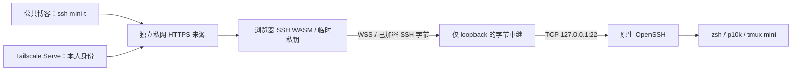

# Mac mini：真实 SSH WASM 终端

状态：已实现。用户确认使用浏览器生成的独立密钥，以及 Tailscale 私网访问。

网页客户端在浏览器 WASM 内执行 SSHv2 握手、ED25519 签名、主机校验、加解密和 PTY 会话。Mac mini 上的 Go 服务仅把二进制 WebSocket 字节转发至固定的 `127.0.0.1:22`，不运行 shell、PTY、ttyd 或服务端 SSH 客户端。真实 shell 和终端状态全部来自 Mac mini。



## 使用

先在访问设备上连接同一 Tailscale 网络，并开启 **Use Tailscale DNS**。使用系统 HTTP/SOCKS 代理的设备，需要将私网 `*.ts.net` 域名设置为 DIRECT / 代理绕过。入口由部署脚本输出，以 `https://<mini 的 MagicDNS 名称>:8443` 的形式存在于本机私有运行配置，未写入公共仓库。

在博客终端中设置一次入口，然后执行真实连接：

```text
ssh config https://your-mini.your-tailnet.ts.net:8443
ssh mini-t
```

未设置时，`ssh mini-t` 会要求输入私网 HTTPS 来源。来源只存在当前浏览器 localStorage 中，禁止 URL 口令、token、额外路径或参数。连接打开独立来源，以隔离博客 Giscus、文章增强及页面快捷键。真实客户端没有网页工具栏、模拟 tmux 或网页命令处理器；`Ctrl+q`、vi 和 Option/Alt 键直达真实 tmux。

关闭/刷新浏览器仅断开 SSH 客户端；已有 `mini` 会话与任务继续运行。断开后可以按 Enter 重新连接。重新连接仍附着相同会话：

```sh
sh -lc 'LANG=en_US.UTF-8 LC_CTYPE=en_US.UTF-8; exec /opt/homebrew/bin/tmux -u new -A -s mini'
```

## 身份、密钥及授权

- Tailscale Serve 根据设备身份注入 `Tailscale-User-Login`，并剥离客户端伪造的身份头。HTTP 静态资源、配置、证书签发和 WS 握手均限制为部署账户本人。Tagged 设备没有用户身份头，会被拒绝。[Tailscale Serve 官方说明](https://tailscale.com/docs/features/tailscale-serve)
- Go 服务仅绑定 `127.0.0.1:8022`；不要将此后端直接开放到 LAN、公网或 Funnel。本机拥有者进程属于信任边界。
- 浏览器每次加载生成独立 ED25519 密钥，配置强制 `persist: false`，不创建持久 IndexedDB 密钥库。私钥从不上传、从不读取现有 `~/.ssh/id_ed25519`；页面内存中的密钥不保证能对抗恶意浏览器扩展。
- `/cert` 接收唯一的 OpenSSH 公钥，返回本人 principal 的 **20 分钟 SSH 用户证书**。检查严格 Origin 和 SameSite Secure cookie / CSRF token；证书限制只能从 SSH 服务器 loopback 地址使用。有效期限制新的认证，已建立的 SSH 会话不会在 20 分钟时被踢出。
- 独立用户 CA 存在 Mac mini 私有状态目录，模式 `0600`。安装器保留原 authorized_keys 并先备份，再添加本人 principal 限定的 `cert-authority` 行；不修改系统 sshd 配置。
- 固定校验通过现有严格 SSH 连接读取的 ED25519 主机密钥；拒绝不匹配且不给跳过选项。确认主机确实换钥后才重新部署。
- CSP 禁止 iframe、第三方脚本和远端资源。中继限制 8 个连接及每条 WS 消息 1 MiB；关闭时取消两向传输并关闭 TCP。日志不记录终端 I/O、密钥、口令或命令。

## 可复现构建和安装

```sh
npm run ssh:build
npm run ssh:test
npm run ssh:deploy -- mini-t
```

构建从 MIT 许可的 [c2FmZQ/sshterm](https://github.com/c2FmZQ/sshterm) 固定提交 `86cc3e666a34b2b3835ae832502ea123a02bb072` 生成 Go WASM，使用 upstream 锁定的 xterm 包。只应用可校验补丁：自动连接命令请求 PTY、使用 xterm-256color、固定 ED25519 主机校验、移除自动连接的工具横幅。构建器还生成 Darwin arm64 中继，复制现有 FiraCode Nerd Font 和相应许可证。

要求 Node.js 22+、Go 1.26+，目标为安装了 Homebrew tmux/Tailscale、启用 Remote Login 的 macOS arm64。原生 SSH alias 必须可用且 known_hosts 已验证。构建/运行资产被 Git 忽略，公共 Pages 构建不包含 WASM 运行配置、私网地址、CA 或终端记录。

安装器在当前远端用户下运行，不要求 root；部署至 `~/.local/share/mini-ssh-wasm/` 并创建 `com.ryou.mini-ssh-wasm` 用户级 LaunchAgent。退出该 macOS 用户、重启且尚未登录或主机睡眠时，用户级服务不保证可用；需要长期无人值守时另行决定自动登录、休眠和系统级启动策略。

首次使用 Serve，CLI 可能要求 tailnet 管理员开启 HTTPS/Serve；安装器只配置专用 `8443` 端口，并检查已有处理器，不覆盖其他端口，不开启 Funnel。需要先部署 loopback 服务时可用：

```sh
npm run ssh:deploy -- mini-t --skip-serve
```

## 验证与回滚

本次已通过真实 Mac mini 的浏览器 SSH 验证：远端 Darwin 命令、UTF-8、真实 tmux prefix 分屏、PTY resize、刷新保留 panes、内存密钥、host pin 不匹配拒绝连接；仅创建并清理 `wasm-validation` 临时窗口，不终止已有任务。Live 测试需显式运行，不放入常规 CI：

```sh
MINI_SSH_URL=https://your-mini.your-tailnet.ts.net:8443/ node ssh-portal/tests/live.mjs
# 系统代理未配置绕过时，测试浏览器可单独直连，不修改全局代理：
MINI_SSH_URL=https://your-mini.your-tailnet.ts.net:8443/ MINI_SSH_DIRECT=1 node ssh-portal/tests/live.mjs
```

`ssh:test` 覆盖非本人拒绝、CSRF/Origin、证书签名/用户/过期/来源、非法公钥、CA 文件权限/禁止覆盖、二进制完整性、连接数和断开清理。博客原有构建、路由、SEO 和浏览器测试继续执行。

停止入口及用户服务：

```sh
tailscale serve --https=8443 off
launchctl bootout gui/$(id -u)/com.ryou.mini-ssh-wasm
```

撤销浏览器 SSH 授权时，只删除 `~/.ssh/authorized_keys` 中末尾标记为 `mini-wasm-user-ca` 的那一行，保留其他 SSH 授权。保留/删除状态目录由本人决定；删除 CA 后再次部署会生成新 CA，需要确认只保留新授权行。若需要恢复本次启用前的 DNS 偏好，运行 `tailscale set --accept-dns=false`（此后私网域名需要设备自行解析）。

## 后续可选扩展

当前实现满足私网浏览器真实 SSH。完整 OpenSSH 协议协商由 WASM 客户端执行，但专用页面当前只提供交互式 SSH 终端；没有另做 GUI SFTP、浏览器文件管理或任意目标主机输入。

无需 Tailscale 的设备访问、WebAuthn 持久身份、独立用户会话、同页 pane 嵌入等为后续选择。它们涉及认证和跨来源信任边界，应单独实现与验证；公共访客不会获得机器权限。
