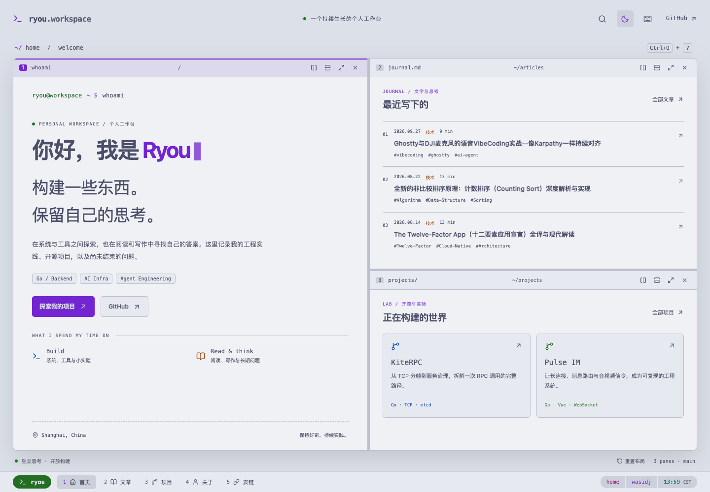
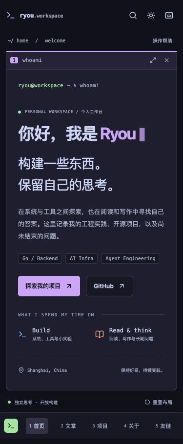
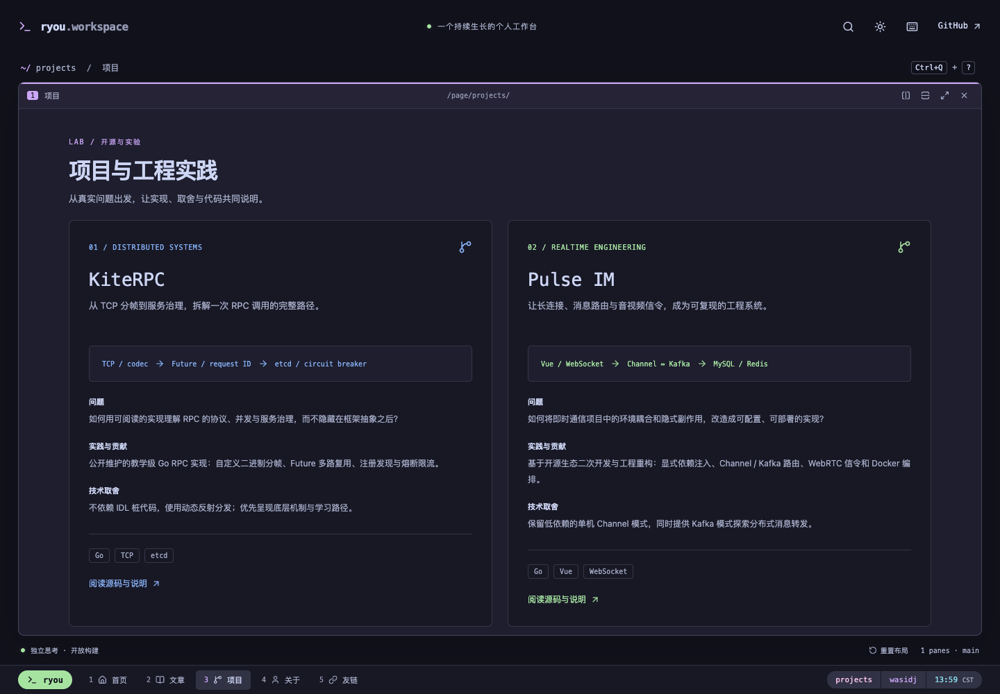

# Next.js 迁移与验收

## 基线与来源

迁移日期：2026-10-08。代码和内容仓库继续分离，没有自动发布 NOTE 中未提交的文章。

| 来源             | 固定版本                                   | 用途                                       |
| ---------------- | ------------------------------------------ | ------------------------------------------ |
| hugo-main        | `b9995bc550227886946fbdb63432dc1baeb23d0f` | 原 Hugo 配置与部署工作流                   |
| wasidj.github.io | `4b35edd0fcda5666d86a0082ce114f8fbfcdf731` | 原站产物、167 条 HTML 路径、回滚基线       |
| blog-content     | `eb491436d41130c0585c08eb0cfc72a3be1ae4ff` | 8 篇正式文章、16 篇草稿与 1 个隐藏工具文件 |
| WASIDJ/.config   | `b5af7423eb7021ffb45cbe4ecec19c0ba76f5c3e` | tmux 配置快照                              |
| kite-rpc         | `3616a301fa6db13aefac55f61c5879b22596b00e` | RPC 项目案例的 README 依据                 |
| pulse-im         | `f9d13288036452a7c03a1e672ba6e500f5a30970` | IM 二次开发与重构案例的 README 依据        |
| sparksite        | `1ba82ce1986bfc8b2aea6c1660535de1c376628f` | Agent 平台案例的 README 依据               |
| y2b              | `38eb419c104d04551ea1364f06415375c82fd510` | Go 编排服务案例的 README 依据              |

项目描述是对公开 README 的提炼，未独立审计项目的性能或生产稳定性；未加入未经证实的工作经历、业务指标或个人独占贡献。原 Obsidian 文章正文未改写。浅色主题使用经过对比度调整的 Catppuccin Latte 色值。

## 数据流

```text
blog-content（已提交 Markdown）
  → 固定 Git SHA
  → 内容清理、数学与代码编译
  → 页面目录 / 搜索 / RSS / sitemap / pane 内容
  → Next.js 静态导出
  → HTML 路径与 canonical 审计
  → GitHub Pages

Cloudflare /api/article-stats + D1：沿用
Giscus：沿用仓库、分类和原主路径
```

`migration/legacy-routes.json` 包含原站路径与原产物提交，`migration/legacy-sitemap.xml` 保存原 sitemap。新构建的 `/route-map.json` 列出每条旧路径对应的 canonical，`/build-info.json` 记录内容版本。旧分页页作为原栏目的兼容入口，主栏目一次展示所有内容。

## 验证

- 单元测试：中文路径、别名、非法 URL、HTML 清理、数学、表格、代码、Mermaid 源码、callout、脚注、标题去重、草稿隔离、分屏上限、布局合并、尺寸约束与损坏状态。
- 浏览器测试：分屏 / 关闭 / 放大 / 方向焦点 / 比例调整、刷新恢复、前缀重绑定与关闭、输入避让、浏览器后退、模态焦点、375 / 768 / 1024 / 1440 布局、深浅色 Axe、无 JS 阅读、搜索、404、原评论标识、统计路径 / 完成 / 去重、真实 pane 加载与失败降级、边注和手机弹层。
- 统计测试拦截全部生产域名请求。自动测试不会向真实 D1 写入阅读数据，也不会发布 Giscus 评论。
- 静态导出验证所有 167 条旧 HTML 路径、canonical、JSON-LD、验证文件、RSS、sitemap 与搜索索引。新内容有未映射的旧路径时构建失败。
- Lighthouse 测量移动端 Performance / Accessibility / SEO；最终结果见 `docs/verification.json`。本机静态预览采用 gzip 与哈希资源长期缓存，关闭了自动预取整篇文章。测量不能代表 CDN 或真实访客的长期指标。

预览：






## 上线检查

1. CI 检查、浏览器测试和 artifact 构建通过后，发布同一流程产生的 `out/`。
2. 读取正式域名的 `/build-info.json`，核对内容 SHA 和 renderer。
3. 请求首页、项目页、中文文章、旧英文别名、Google / Bing 验证文件、RSS 与 sitemap，核对状态、canonical 和正文。
4. 确认无效路径仍是 404，统计 GET 能读取已有数据。真实访问再观察评论加载和浏览器读完事件。
5. 之后在现有 Google Search Console / Bing Webmaster Tools 中观察抓取、404 和索引趋势。索引和 AI 引用结果不能通过部署检查即时确认。

## 回滚

原网站完整产物已保存为本机 `.cache/hugo-site-4b35edd.tar.gz`，同时保留 GitHub 提交 `4b35edd0fcda5666d86a0082ce114f8fbfcdf731`。代码仓库中的 Hugo 配置、模板、主题子模块仍存在，原工作流保存在 `migration/hugo-deploy.yml`。

如需恢复 Hugo：先暂停新的 Next.js 生产发布；在网站产物仓库基于当前 main 用 `git restore --source=4b35edd0fcda5666d86a0082ce114f8fbfcdf731 -- .` 恢复旧产物，并以普通提交发布；在代码仓库恢复原 Hugo 工作流。采用普通提交，不重写历史。恢复后核对域名、验证文件、旧文章与统计接口，再恢复内容发布。

首版保留中文内容、既有评论与统计服务。中英双语、CMS、登录、真实 shell 执行和私人 Codex 额度展示不在本次实现中。
